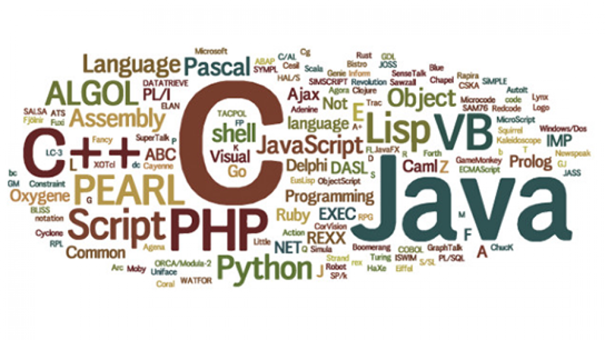
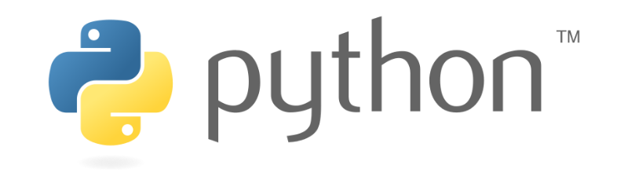

# <b>Chapter 1. Introduction</b>

## <b>1. 튜토리얼의 목표</b>

이공계생을 위한 인공지능 길라잡이는 다음과 같은 목표를 갖고 진행을 하겠습니다.

1. 연구자의 입장으로써 인공지능과 마주할 올바른 자세를 함양
2. 인공지능 기술을 연구에 접목시키기 위한 사고방식의 함양
3. 실제 인공지능을 다룰 능력의 함양

또한 이 튜토리얼을 쓰는 필자는 튜토리얼의 주제가 될 인공지능과 컴퓨터에 관하여는 비 전공자이며, 필자 본인도 공부하는 입장에서 튜토리얼을 작성하게 되었기에, 간혹 틀린 내용이나 필자 개인의 견해가 들어간 내용이 있을 수도 있다는 것을 사전에 밝혀둡니다.

## <b>2. 프로그래밍 언어에 관한 고찰</b>
### <b>2.1. 프로그래밍 언어에 정답은 없다</b>

프로그래밍 언어는 컴퓨터와 대화를 하기 위해 수단으로, 정말 다양한 종류의 언어가 존재한다. 컴파일 언어로 유명한 C/C++나 최근 인기가 최고조에 달한 Python, 웹 사이트를 표현하는 꾸준하게 사랑받고 있는 마크업 언어인 html 등 다양한 언어가 다양한 현장에서 다양하게 쓰이고 있다.

이에 따라 생겨난 질문이,

<b>"프로그래밍 언어를 시작해야 하는데, 어떤 언어부터 시작해야 하나요?"</b>

이다. 많은 사람들이 프로그래밍 공부를 시작하면 이와 같은 질문을 던지고 (구글에 검색을 하고) 시작한다.

이에 대한 대답은,

<b>"프로그래밍 언어에 정답은 없다"</b>

가 모범 답안이라고 생각한다. 프로그래밍 언어를 "컴퓨터"라는 외국인과 대화하기 위해 공부한다고 가정하여 생각해보자. 외국어를 공부하는 경우, 우리는 영미권에 가기 위해서는 영어를, 일본에 가기 위해서는 일본어를 공부한다. 영어 사용자의 비율이 높다고 일본에 가는데 영어를 공부한다던가, 일본어가 인기가 있다고 프랑스에 가는데 일본어를 공부하는 사람은 없다. 프로그래밍 언어도 같은 맥락에서 생각하면, 공부하려는 학습자 본인이 앞으로 언어를 사용하고자 하는 목적에 맞게 언어를 선택하는 것이 옳다.

### <b>2.2. 어떤 언어가 인공지능 활용에 최고일까?</b>

연구 능력과는 무관하게 인공지능을 처음 다루기 시작하는 사람 입장에서는 Python을 이용하여 코딩을 하는 것을 추천한다.

Python의 장점을 한마디로 정리하면, 배우기 쉬우며 활용하기 쉬움 이다. Python은 컴파일이 필요없는 스크립트 언어로써, 코드 작성 또한 간결해서 초심자를 위한 입문용 프로그래밍 언어로도 인기가 많다. 전체적인 코드 기술이 영어의 기술과 유사하며(그렇다고 완전한 영어 문법을 따른다는 의미는 아니다), 줄바꿈이나 들여쓰기로 코드의 공간을 구분하기 때문에 중괄호가 남발된 코드를 볼때의 아찔한 느낌이 들지 않는다. 또한 파이썬으로 쓰여진 유명한 라이브러리가 많고(<u>특히 이 특징이 Python이 데이터 사이언스나 인공지능 분야에서 주목받는 이유이기도 하다</u>), 객체 지향 언어이기에 동작의 추상화가 쉽다는 점, 라즈베리파이를 이용한 임베디드 언어의 직,간접적인 체험 등 광범위한 활용이 가능하다는 것 또한 Python의 장점으로 꼽을 수 있다.

반면 이러한 Python에도 단점은 존재한다. 필자가 체감한 Python의 단점을 한마디로 정리하면, 퍼모먼스의 한계와 알기 힘든 에러들 이다. Python은 C/C++와 같이 개발자가 쓴 코드 전체의 동작을 컴퓨터 언어로 바꿔주는 컴파일 언어가 아닌, 개발자가 쓴 한줄 한줄의 동작을 컴퓨터가 즉석에서 해석해서 넘겨주는 인터프리터 언어이다. 따라서 그만큼 코드를 실행하는데 시간이 소요되며, 같은 동작을 하는 코드를 기술했을 시 컴파일 언어에 비해 적게는 몇배, 많게는 몇백배로 시간이 소요된다는 단점이 있다. 또한 Python은 동적 타이핑 언어이기에 개발자가 코드를 기술하기 편하다는 장점도 있지만, 그만큼 수면 아래에서 작동하는 부분이 많아져 개발자 입장에서는 도무지 왜 일어나는지 직관적으로 알기 힘든 에러가 종종 발생한다는 단점도 존재한다.

다만 오해해서는 안되는 것이, Python의 단점들이 실제 연구를 하는데 있어서 크게 다가오는가 하면 그렇지 않다는 것이다. 물론 연구하는 환경에 맞는 새로운 실험장비를 설계하고, 그 실험장비에 맞는 펌웨어 및 임베디드 개발이 필요로 된다면 Python은 좋은 선택이 아닐 수도 있다(이러한 경우에는 VHDL과 같은 하드웨어 언어나 C/C++, Java같은 언어가 알맞다). 하지만 본 튜토리얼의 주제인 이공계 실험을 위한 인공지능의 설계에 있어서는 Python으로도 충분하며, 연구자가 그 이상으로 프로그래밍에 깊게 파고들 이유가 없다. 이 내용에 관해서는 다음 장에서 깊게 알아보도록 하자.

## <b>3. 인공지능에 대한 고찰</b>

### <b>3.1. 이론 공부에 빠지지 말것</b>

이공계생이 흔히 하는 실수 중 하나가, 모든 현상의 논리관계를 너무 깊게 너무 어렵게까지 파고들려고 하는 것이다. 물론 이것이 본인의 연구 주제와 부합하는 경우에는 오히려 좋은 자세이나, 문제는 컴퓨터 프로그램에까지 그러한 자세를 보인다는 것이다.

이런 실수가 일어나는 이유는 많이 있으나, 그중 하나가 인공지능 코딩이 사용자 UI가 제공되는 여타 다른 프로그램과는 달리 마치 우리가 매드 사이언티스트가 된 것 마냥 길고 어지러운 코드를 끊임없이 써내려가는 모습에서 비롯된다. 우리는 공학계산기를 사용할때, 사칙연산이 이루어지고, 함수의 미적분이나 행렬계산의 추상적인 개념만을 이해하고 필요한 계산만 수행하고 끝내지, 그 물밑에서 미적분이 컴퓨터 코드로 어떻게 기술되있고, 어떤 비트 연산이 이루어지고 있는가 신경쓰지 않는다. 인공지능을 사용할때도 이와 같은 자세가 필요하다. 물론 잘 만들어진 계산기를 사용할 때처럼 정해진 버튼을 누르는 것 보다는 한참 "프로그래머"답긴 하다. 하지만 결국에는 만들어진 인공지능 계산기(이를테면, tensorflow 등)를 필요한때 맞춰서 사용하기만 하는 된다. 필요한 계산을 하고 필요한 데이터를 얻어내면 거기서 끝이다.

또한 인공지능을 bottom up 방식으로 접근하는 함정에 빠져서도 안된다. 인공지능의 기반에 있는 수학적인 이론을 전부 이해하려한다면, 대학교를 한번 더 다녀야할정도로 그 양이 방대하고 난이도 또한 어렵다. 당장 눈앞의 연구로도 바쁘고 배워야할 것이 산더미인데, 신경망회로의 수학적 검증이나 머신러닝 알고리즘의 논리적인 고찰을 필요 이상으로 깊게 파고드는것은 상당한 시간 낭비가 될 것이다. 현재 개발된 유명한 머신러닝 알고리즘들은 그 자체로 연구 가치를 갖고 있고, 많은 전공자들이 매달려서 검증되어 있다. 따라서 그런 선구자들을 믿고, 수학적으로 검증하는데 너무 많은 열정을 쏟지 않길 바란다. 당장에 코딩을 해보면 그러한 이론들이 거의 사용될 일이 없다는 것을 알게 될 것이다.

### <b>3.2. 모든 것을 공부할 필요는 없다</b>

머신러닝/딥러닝 내용은 그 자체로도 방대한 양을 갖는다. 지도학습, 비지도학습, 강화학습을 각각 구현해내기 위한 알고리즘, 신경망 회로의 수많은 디자인들, 또 각각의 알고리즘에 사용되는 활성화함수나 최적화함수도 상황과 목적에 맞게 정말 다양하게 디자인이 되어있다. 그런 각각의 요소들을 전부 다 공부할 필요가 없다.

책 한권을 읽기 위해서, 우리는 국어사전에 실린 모든 단어를 전부 다 외울 필요가 없다. 우리가 사전에 알고 있는 어휘력에 더해서 부족한 부분을 사전에서 찾으면 된다.

### <b>3.3. 섵불리 알고리즘에 도전하지 말 것</b>

이것은 3.1절의 내용과도 연결된다.

### <b>3.4. 처음부터 완벽할 수 없다</b>

코딩을 한다는 것은 그 자체로 일종의 실험과 같다. 우리에게 주어진 수많은 변수들이 있고, 우리는 그것들을 이용하여 원하는 결과를 도출해내야한다. 참고할만한 코드는 인터넷에 널렸지만, 당장 내가 쓸 연구에 사용할 코드는 스스로 만들어나가야 한다. 정답도 없고, 가져다 쓸 만한 완성품도 없다면 어떻게 해야하는가? 우리는 단순히 시행착오를 거치면서 고쳐나가고 만들어나가는 수 밖에는 없다. 코드를 다시 짜는것을 귀찮아하지 말아라. 안되면 다시 만들면되고, 에러가 나면 하나하나 고쳐나가면 된다. 결과가 안좋으면 다른 알고리즘을 사용해보고, 이도저도 않되면 인공지능 이외의 다른 방법을 찾는것도 좋다. 처음부터 완벽한 코드를 만들작정으로 달려들지도 말고, 그렇게 촉박한 상황에 빠지지 않게 부지런하여라.

### <b>3.5. 모든 도구는 강력하다</b>

코딩을 하는데에는 여러가지 도구가 존재한다. 코드를 기술하는데 필요한 프로그래밍 언어가 있고, 코드를 기술하기 위해 필요한 IDE가 있으며, 코드 실행을 위한 다양한 패키지와, 인공지능에 있는 다양한 알고리즘들이 존재한다. 이번 절에서 말하고자 하는것은 프로그래밍 언어, 코드 기술 프로그램, 실행 패키지와 같은 것에 대한 이야기이다.

### <b>3.6. 인공지능은 만능이 아니다</b>

## <b>이공계생과 인공지능</b>