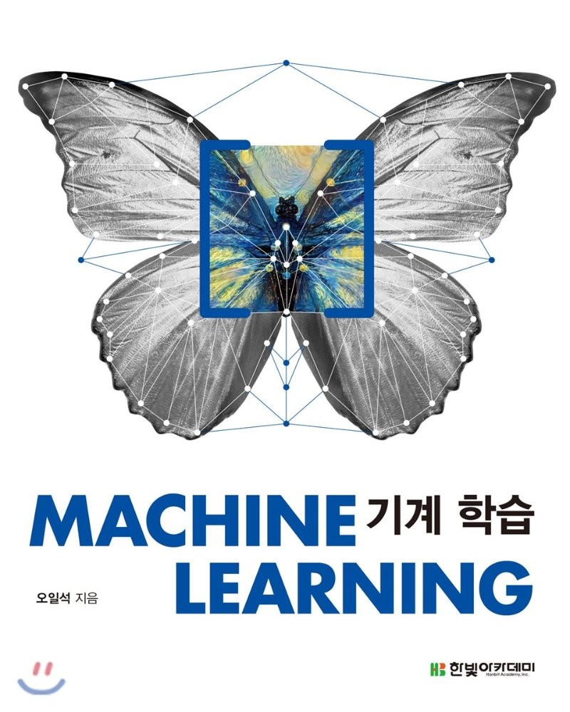

# 교재 정보

- 제목 : MACHINE LEARNING 기계학습 초판(홍보용)
- 저자 : 오일석
- 출판 : 한빛아카데미

# 페이지 정보

본 페이지는 주 교재인 "기계학습"의 연습문제 풀이를 위해 작성됨.

수학적 계산이 필요로하는 문제는 Python을 활용하여 최대한 정답을 도출하도록 노력하였으며, 주관적 생각을 기술하는 문제에 관하여는 풀이자 본인의 주관적 생각이 담겨있거나, 풀이가 없는 경우가 있음.

각각의 챕터별로 폴더를 나누어 작성하였으며, 폴더는 연습문제 본문과 정답과 풀이 (Python 스크립트 혹은 서술답안) 로 구성됨.

# 목차

1. 소개
2. 기계 학습과 수학
3. 다층 퍼셉트론
4. 딥러닝 기초
5. 딥러닝 최적화
6. 비지도 학습
7. 준지도 학습과 전이 학습
8. 순환 신경망
9. 강화 학습
10. 확률 그래피컬 모델
11. 커널 기법
12. 앙상블 방법