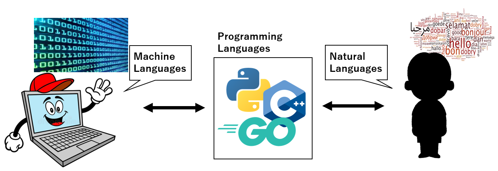

# Basic Tips for Starting Programming

## General Tips
1. __사용하고 싶은 언어를 정할 것.__ 어떤 언어가 쉽다, 저 언어가 활용성이 좋다, 이 언어가 요새 인기다, 이런 소문들은 사실 별 의미 없음. 일본어가 인기 있다고 해서, 조만간 프랑스갈 사람이 일본어 공부한다고 되는게 아니듯이, 너도나도 Python쓴다고 반드시 Python을 쓸 필요는 없다는 뜻. 같이 일하는 사람들이 어떤 언어를 쓰는지, 내가 속한 분야에서 주로 사용하는 언어가 무엇인지 파악하고, 한 언어를 선택해서 깊게 파는것이 중요함.
2. __기본적인 언어 공부는 필수.__ 영어 논문을 보려면 영단어를 외우고, 영어 문법을 공부하고, 실용적으로 영어를 어떻게 사용하는지, 내 분야에서 자주쓰는 구문, 표현법은 무엇인지, 실제 문제도 풀어보고 자격시험도 보는 등 공부해야하는 것과 마찬가지. 내가 공부하려는 프로그래밍 언어는 변수는 어떻게 표현하고, 내장함수는 어떻게 쓰고, 이 언어는 어떤 기능들이 있으며 실제 사람들은 어떻게 코딩을 하는지 공부를 해줘야함. 이 부분이 안되면, 다른 사람이 만든 코드 의존도가 높아지고, 내 작업&연구에 최적화된 코드를 작성할 수 없어지고, 작업 능률도 떨어짐.
3. __매일 꾸준히.__ 프로그래밍 언어도 결국 언어기 때문에 매일 서너시간씩 꾸준히 써보는게 중요함. 마냥 책에 있는 예제를 짜보는것도 좋고, 전공 서적 계산식을 푸는 코드를 만들어보거나, 다른 사람이 만든 재밌어보이는 코드를 클론해보는 것도 나쁘지 않음. 단 복붙해놓고 서너시간 지긋이 바라보는건 그닥 도움안됨. 코딩이 손에 익기 전에는 코딩 공부 하루 빼먹으면 다음날 하나도 기억 안나고 에러가 잔뜩한 코드를 쓰는 일도 일어남.

## Programming Paradigm
프로그래밍 언어 패러다임 간단 정리. 밑에 내용들이 반드시, 엄격하게 구분되는 것은 아니고, 코드를 짤 때 어떤 식으로 접근할지 생각하게 해주는 정도. 단, 언어별로 한 패러다임을 기본 개념으로 잡고 개발된 경우가 있어서, 그런 경우에는 각 패러다임에 맞춰서 코딩을 해줄 필요가 있음. C++, Python 이런 애들은, 멀티패러다임 언어라고해서, 상황에 맞춰서 각 패러다임에 맞게 코딩을 할 수 있게끔 필요한 기능이 갖춰져있음. 어떤 패러다임은 나쁘고 저 패러다임은 좋고 이런 개념이 아닌, 순전히 생각하는 방식일 뿐.

### 명령형(Imperative) vs. 선언형(Declarative)
1. 명령형: 어떻게 계산을 할지 죽 나열하는 방식으로 코딩을 함. 전체 계산 흐름의 순서를 명시적으로 알 수 있어서 처음 코드를 읽는 사람도 내용 이해가 편하고, 작성하는 사람도 의식의 흐름대로 작성하면 되서 편함. 대신 어떤 한 부분에 에러 혹은 버그가 발생했을때, 자칫하면 전체 코드를 죄다 수정해야할 수도 있고, 위에서 발생한 문제를 제때 처리를 못하면 전체 내용물이 변해는 신뢰도 문제가 있음.

  ex) 측정치 파일을 읽어서 (100x100) 배열에 순차적으로 집어넣고, i를 1부터 100까지로 (ix100)의 100개씩 평균, 분산을 계산하고, i의 100개치 가우시안 그래프를 그려서 이미지 파일로 저장하라.
  
2. 선언형: 각 파트에서 무엇을 할지 정해줌. 명령형의 각 단계를 잘게 쪼개서 모듈화 시키는 작성방식. 계산 단계가 쪼개져있고 각 계산 방식이 정해져있어서, 어떤 부분에서 에러 혹은 버그가 발생하면 그 부분만 수정해주면 되서 유지보수가 편하고, 각 단계가 할 일이 정확하게 정해져있어서 계산 신뢰도도 높음. 단, 메인 함수가 추상적이게 작성되서 읽는 사람이 실제 코드 작동 방식을 이해하는데 어려움이 있고, 계산 단계끼리 모순없이 짜야되서 작성할 때 고려해야할 사항이 많아짐.
  
  ex) 데이터배열작성. 데이터통계계산. 데이터가시화.

### 명령형 프로그래밍의 절차지향(Procedural) vs. 객체지향(Object-Oriented)
1. 절차지향: 명령형의 대표격 패러다임. 순수하게 절차적으로 프로그래밍을 쓰면, 한 코드 내에 모든 계산 절차가 순서대로 좍 나열되서 그냥 위에서부터 순서대로 읽어가면 이 코드가 무슨 계산을 하는지 파악하기 쉬움. 대신 "무슨 계산"을 하는지는, 리스트 인덱스 몇번째부터 몇번째까지 더해준다던지, 이 변수를 저 변수로 복사한다던지 같은, 컴퓨터가 어떤 계산을 하는지를 잘 알 수 있다는거지, 각각 계산이 어떤 의미를 갖는지는 변수명으로 추리하거나 코멘트를 잘 읽어보는 수 밖에 없음.

2. 객체지향: 객체(Object)라는 큰 공장을 다루게됨. 공장에는 일꾼이 몇명인지, 공장 크기는 얼만지, 어떤 처리들을 할 것인지 내용들이 담겨져있음. 절차지향에서는, 넓은 공터에 할일을 바리바리 싸들고와서 하나하나 나열해가면서 일처리를 하던것을, 객체지향에서는 공장이라는 객체로 묶어서 처리하는것. 사용자는 공장을 불러오고, 공장 내부 함수로 공장 상태를 바꾸거나 원하는 값을 출력하기만 하면 됨. 대신, 이번 계산에는 필요없는 함수까지 불러오는 공장에 죄다 들어있어서, 불필요한 메모리를 차지할 경우가 많고, 기본적으로 절차지향보다 느림. 그래도 메인 함수가 추상적이라 사람이 보기에는 이해하기 편함. 객체지향 3대 특성이 캡슐화, 상속성, 다형성 이라고 하는데 참고정도로만 알아두고 궁금하면 구글검색.
 
### 선언형 프로그래밍의 함수형(Functional) vs. 논리형(Logical)
1. 함수형: 선언형 프로그래밍 하면 거의 함수형 프로그래밍을 말함. 모든 계산은 높은 신뢰도를 갖는 잘게 쪼개진 함수로 이루어짐. 코드에는 내부에서 변하는 상태 같은것은 없고, 그저 입력(input)과 출력(output)이 있을뿐. _(입력)_10명이 공장에 들어갈때는 _(내부상태)_온도가 20도라 _(출력)_생산량이 10이었는데, _(입력)_100명이 공장에 들어가니 _(내부상태)_온도가 30도라 _(출력)_생산량이 5가 된다 같은것은 함수형에서는 허용안됨. 
2. 논리형: 코드를 and or nand nor xor 같은 논리회로처럼 짜는 건데, 잘 안씀. 그냥 이런 패러다임도 있다 정도로 알아두면 됨. 솔찌 이건 나도 잘 모름.
