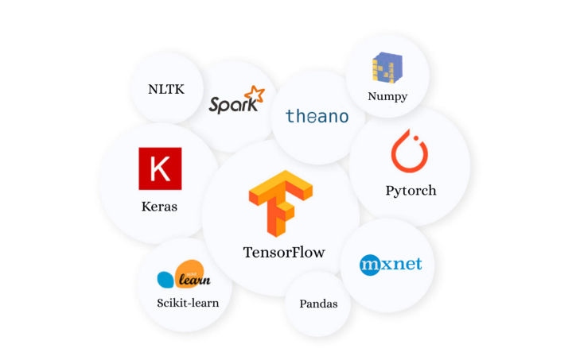
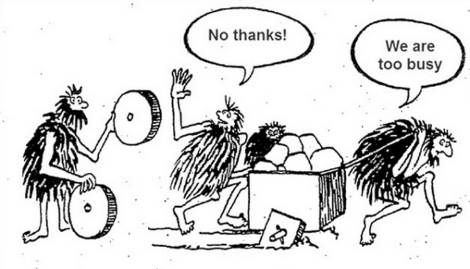
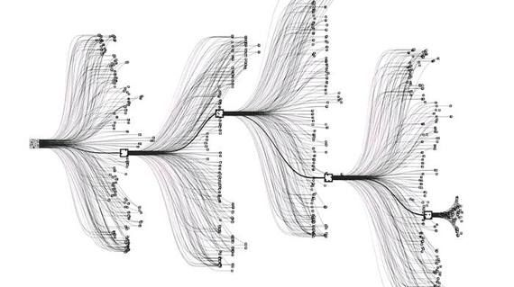
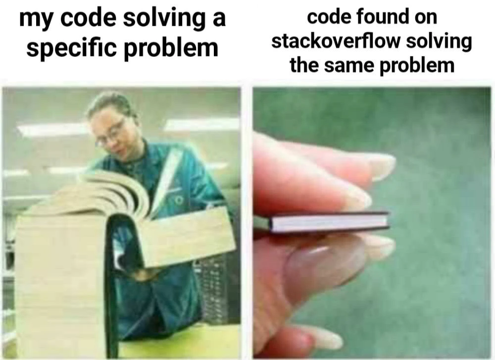

# Tips
머신러닝을 공부하는데 있어서의 몇가지 팁

## 초심자를 위한 팁들
- <b>(본인이 프로그래밍/알고리즘에 특출난 재능이 있지 않는한) 되도록 공식적으로 배포되있는 패키지, 커뮤니티에 올라와 있는 (유명하고 인기있는) 예제 코드를 다운받아서 실행해보자.</b> 배포된 코드의 몇가지 파라메터를 변경해보거나, 활성화함수를 다른것을 써보고, 신경망 은닉층 한두개를 만져보는것도 훌륭한 공부가 된다. 처음부터 새로운 무언가를 발명한다는 것은 무척이나 어렵고 비효율적이며 위험한 행동일 수 있다. 실제로 이미 만들어진 서비스를 똑같이 따라서 만들어보는 "클론코딩"은 프로그래밍에 있어서 훌륭한 공부법 중 하나로 알려져있다.

수많은 패키지들이 현존하고 있고, 현업에 종사하는 많은 사람들이 이러한 패키지를 이용하여 성과를 올리고있다.

- 초심자 프로그래머에게 공통적으로 하는 말이 있다. 영어로는 "Don't reinvent wheel", 한글로는 <b>"바퀴를 재발명하지 말 것"</b>이다. 머신러닝의 중급자 혹은 본격적으로 본인의 연구나 업무에 사용하기 시작하여 새로운 성과를 내는 상황이라면 코드를 뜯어보거나 자신만의 알고리즘을 만들기 시작하는 것이 옳을때가 있지만, 대다수의 경우 현존하는 패키지는 아주 포괄적이게 만들어져있어 다방면으로 적용이 가능하게끔 되어있다. 패키지를 사용하는데 불편하다면 우선은 해당 패키지의 documetation을 참조하자. (특히 머신러닝 관련 패키지는) 본인이 생각했던 것 이상으로 많은 기능이 내포되어있다. 바퀴를 갈고 닦는 것은 최전방에서 연구중인 컴퓨터 공학자들에게 우선 맡겨두자.
  

  
  
  초창기 학습 알고리즘이 개발되는 상황에는 위의 그림과 같은 경우가 많았지만,
  
  현재 만들어진 패키지들은 아래 스포츠카에 장착된 바퀴와 같이 이미 훌륭한 수준으로 개발되어있다.

- <b>프로그래밍 언어 선택은 입문자에게 쉽다고 알려져 있는 언어(이를테면, Python)를 선택하자.</b> 사람이 사용하는 언어(한글, 영어, 일본어, ...)와 다르게 프로그래밍 언어는 결국에는 컴퓨터가 알아들을 수 있게끔 바이너리 코드(01010011...)로 변환해주는 중간 매개체 역할을 한다(물론 사람도 궁극적으로 보면 같다). 따라서 모든 프로그래밍 언어의 기술 방법은 크게 차이가 없어서, 초반에 입문 난이도가 낮은 언어를 선택하여 우선은 코딩 자체에 익숙해지도록 하자. 입문자에게 쉽다고 알려진 것에는 다 그럴만한 이유가 있다.
  

  
  현존하는 프로그래밍 언어를 나열해보면 정말 다양한 종류의 언어가 있다는 것을 알 수 있다.
  
  참고로 가장 잘 알려진 C언어는 2021년 기준으로 난이도가 높은 언어 중 하나이다.

- <b>책을 읽자.</b> 프로그래밍 관련 공부를 할 때는 서적을 보지 말라는 이야기도 많다. 하지만 머신러닝에 있어서는 초반에는 정식으로 출판된 책을 읽으며 그 개념을 잡고 가는것도 나쁘지 않다. 머신러닝 자체가 굉장히 경험적이고 발견법적인 성격이 강해서, 내용이 추상적인 부분이 아주 많다. 따라서 처음 접하는 사람이 다짜고짜 현업에서 작동되는 코드를 읽는다 한들, 그 추상적인 개념이 잘 잡히지 않을 가능성이 크다. 그럴때는 본인의 모국어로 잘 설명된 책을 한권 정해서 읽으면서 그러한 설명과 개념을 익혀나가자.

- <b>수학에 너무 목메지 말자.</b> 물론 머신러닝을 하는데 수학은 중요하다. 평가함수나 활성화함수의 사용, 각 은닉층간의 계산과 텐서의 개념 등 선형대수와 해석학이 난무한다. 하지만 이러한 이론적인 배경은 머신러닝을 코딩하는데 있어서 거의 쓰이지 않는다. 대부분의 활성화함수는 잘 어울리는 알고리즘이나 활용이 알려져있는 경우가 많으며, 실제로도 많은 데이터 분석가들은 그런 지침에 맞추어 사용하고 있다. 처음에는 왜 이런 수식이 사용되는지, 왜 이런 함수가 나왔는지와 같은 개념적인 부분만 잘 잡고 넘어가자. 걱정하지 않아도 어차피 하다보면 차차 익숙해지게된다.

머신러닝/딥러닝에 선형대수, 해석학과 같은 수학은 뗄래야 뗄 수 없는 중요한 요소이다.

하지만 초심자의 입장에서, 이러한 요소는 신경쓰지 않아도 수면 아래에서 알아서 잘 돌아가준다.

## 중급자를 위한 팁들

- <b>생각을 5, 행동을 5.</b> 너무 많은 생각을 하는 것도 좋지 않다. 코딩을 하는 작업이 비록 책상 앞에 앉아서 컴퓨터 키보드로 타이핑을 하는 것 뿐인 작업이지만, 본인이 만들고자하는 기능을 설계, 제작, 시연하는 엄연한 창작활동이다. 집을 짓기 전에 설계만 하다가 끝나버리거나 발명품을 만드려해놓고 구상만하다 끝나면 아무런 의미가 없듯이, 코딩도 머릿속의 이론만 환상적이면 아무런 의미가 없다. 한번에 완벽한 프로그램을 만드려하지말고 우선 덕지덕지 짜맞추어도 괜찮으니 만들기 시작하자.

- <b>양질의 코드를 보자.</b> 특히 공식적인 학술대회, 경진대회에서 좋은 성과를 보인 작품이나 <a href="https://www.kaggle.com/">Kaggle</a> 등 홈페이지에서 많은 사람들이 눈여겨보는 코드들을 자주 살펴보자. 머신러닝의 개념이 어느정도 잡혀가는 중급자부터는 더이상 고정되어있는 책에만 의존해서는 안된다. 프로그래밍의 선생님은 다른 무엇도 아닌 인터넷이다. 시시각각 발전해가는 기술을 실시간으로 모니터링하며 공부하는 방법은 인터넷에 공개된 양질의 코드를 보면서 적극적으로 질문도해보고 코드 개선의 제안도 해보자. 구글링을 잘하는 것도 코딩 실력 중 하나다.

프로그래밍을 하는 모든 사람들에게 stack overflow는 구세주와 같다.

문제해결을 위해 자신이 만든 방대한 양의 코드가, stack overflow에서 찾은 단 몇줄의 코드와 동작이 같을때.

우스갯소리로 만든 짤이긴 하지만, 실제로 많은 사람이 공감하는 내용이다.

- <b>적극적으로 응용하자.</b> 위의 팁과 약간은 상반되는 내용의 팁이긴 하지만, 이제부터는 스스로 개척해나가야하는 순간이 많이 온다. 다른 사람이 만든 코드가 아무리 좋다고 해도, 본인이 해결하려는 문제와 그 사람이 만든 코드가 해결하는 문제가 완벽하게 맞아떨어지는 경우는 많지않다. (물론 간단한 문제들은 예제 코드가 차고 넘치긴 한다) 좋은 것은 좋은 것 대로 흡수하되, 흡수한 것을 완벽하게 본인의 것으로 만드려 노력하자. 

  

  

# 수업 디자인

전반적인 수업 디자인에 관하여 다음과 같은 계획을 작성해보았다. 물론 아래 내용 전부를 한 학기 내에 다루는 것은 어렵지만 가이드라인격으로 생각하여 적절하게 조절해나가면 될 것 같다.

이상적으로는 모든 학생이 수업에 참여하는 것이 중요하다. 학생중에는 코딩을 잘하는 학생, 코딩이 서툰 학생, 수학적 사고가 능숙한 학생, 그 반대의 경우 등 여러 경우가 있다. 팀을 만들어 서로가 서로를 보안해주고 좋은 결과를 내도록 이끌어내는 것이 중요함. 극단적으로 이미 인공지능 개발에 일가견이 있는 한 학생이 팀원 전체는 참여하지 않은 상태에서 혼자서 모든 작업을 주도하는 상황이 가장 나쁜 상황일듯하다.
## 수업 진행

- Kaggle의 Competion참가
  - 16주에 걸친 팀프로젝트로 kaggle의 경진대회 참가
  - 각 주에는 기본적인 프로그래밍과 머신러닝 알고리즘의 바닐라버전에 관한 강의를 진행
  - 주의 첫번째 강의에서는 수업, 두번째 강의에서는 각 팀별 활동이나 각 팀별 보고를 진행(아니면 한주는 수업 한주는 실습)
  - 기본적으로 수업이라해도 어느정도 실습은 동반하게됨
  - 중간평가는 중간성과보고서, 기말평가는 kaggle에 투고한 작품보고 혹은 기말시험

- PPT 활용 강의
  - 회차별로 만들어둔 자료를 활용하여 강의
  - 교재를 따라서 할지, 교재를 참고하여 할지
  - 교재 전용 수업 자료는 이미 교재 홈페이지에 업로드가 되어있음

- 학생 팀 활동
  - 교재 내용을 일정량 정하여 발표
  - 교재에 나와있는 참고 논문을 찾아 읽고 요약하여 발표
  - 깃허브를 이용한 교수-학생, 학생-학생의 활발한 코드 공유
  - 연습문제풀이 등

- 프로그래밍 실습
  - 코딩 자체 테스트
  - 인공지능 알고리즘 구현 테스트

## 수업 구성

### 공통 시작
- Basic Programming: 1~2주
  - Python의 설치와 개발 환경 구축
  - 팀워크를 위한 깃허브(Github)의 활용
  - Python의 기본 문법, 기술 방법
  - 머신러닝에 필요한 필수적인 모듈의 도입, 사용법
  - 프로그래밍 공부방법 등
- Basic concept of Machine Learning/Deep Learning
  - 인공지능 학습의 역사와 발전 배경
  - 머신러닝에 필요한 수학적 개념(선형대수, 미적분, 통계학) 강의
  - 지도학습, 비지도학습, 강화학습의 기본 개념
  - 본 수업의 주제인 인공 신경망의 기본 개념
  - 인공지능의 전망 등

### 안 1. 학습 종류로 나누어 수업
- 지도학습
- 비지도학습
- 준지도학습
- 강화학습
### 안 2. 유명한 알고리즘 중심으로 수업
- Convolutional Neural Network
- Recurrent Neural Network
- Generative Adversarial Network
- Reinforcement Learning

### 실습 스캐쥴
- 팀 만들기(3-6명)
  - 개인활동이나 멤버수가 2명 이하는 허용되지 않음
  - 사회 혹은 대학원 프로젝트는 기본적으로 여럿이서 진행하기에 팀워크가 없이는 살아가기 힘듬
  - 더욱이 혼자서 할만한 프로젝트도 아님. 혹 혼자서 캐리할 자신이 있으면 팀구성원으로써 헌신하는 방향으로 진행하길.
- 필요한 웹서비스 등록
  - Github 계정 만들기
  - Kaggle 계정 만들기
  - (필요시) Google Drive 계정 만들기
- 팀별 Kaggle 경쟁 프로젝트 선정
  - 난이도는 너무 쉽지않게(아마 쉬운 프로젝트는 없을것), 너무 어렵지않게(전공에서 너무 벗어나거나, 본인에게 관심이 없는 분야는 다루기 힘듬)
  - 처음 도전하는 경우가 많을것이므로 너무 과한 기대, 과한 욕심은 부리지 않고 새로운 경험을 제공하는데에 초점
  - 그렇다고 속이 빈 내용으로 진행하는 것은 시간낭비
- 보고 내용
  - 진행할 프로젝트 정리
  - 데이터 전처리 내용
  - 알고리즘 선정과 그 배경, 이유
  - 데이터 분석 결과와 고찰
  - 알고리즘 개선과 그 방법
  - 데이터 및 분석 결과의 가시화
  - 향후 전망 분석
## 평가 방법 후보

1. 일반적인 수업과 마찬가지로 개념에 관한 중간, 기말 필기시험을 진행하는 방법
     - 가장 쉽고 편하며 효율적인 방법
     - 개개인의 평가가 쉬우며, 학생들의 수학적인 개념, 인공지능에 대한 전반적인 개념 확인에 도움이 됨.
     - 수업에서만 진행하는 실습으로는 학생들이 실제 인공지능 알고리즘을 만져볼 기회가 적음.
     - 타 강의와의 차별성은 떨어짐
2. 각자 한 학기짜리 프로젝트를 담당하여 2~3회차에 걸쳐 중간보고 및 최종보고를 진행하는 방법
     - 참신하고 학생들이 잘 호응해줄 경우, 긍정적인 평가로 이어질 가능성이 큼
     - 불가피하게 팀 단위 참여를 하게되므로, 개개인의 평가기준이 모호해짐 (누군가 혼자서 프로젝트 전체를 다 진행해버리는 경우 등)
     - 프로젝트 완급조절이 어려울 수 있음 (예를들어, 누군가는 인터넷 복붙만으로도 구현가능한 머신러닝을 만들어오고 누군가는 너무 어려운 작업을 진행하여 한 학기 내로 제대로된 결과를 못내고. 비전공자끼리 공부하는 경우에 흔히 나타나는 현상 중 하나.)
     - 평가 디자인을 신중하게 해야할 필요가 있음
3. Kaggle을 활용하는 경우
     - 보고 점수(100%): 기본점수(30%) + 보고유무(5*8%(8주분)) + 보고내용(30%)
     - 수업 참여(100%): 수업참여도(50%) + 팀참여도(50%)
     - 필기 시험(100%): 중간 필기 시험(40%) + 최종 성과 보고서(60%) 

# Reference
1. Machine Learning, 한빛아카데미, 오일석 (메인교재)
2. A Byte of Python, Swaroop C. H., 박정빈 역 (부교재)
3. Python Documentation & Python Module(Numpy, Pandas, Tensorflow, Keras, etc) Documentations (부교재)
4. Think Stats, Green Tea Press, Allen B. Downey (참고교재, 양서)
5. Think Bayes, Green Tea Press, Allen B. Downey (참고교재, 양서)
6. Deep Learning and Physics, Kodansya, Akinori Tanaka et al. (참고교재, 일서)